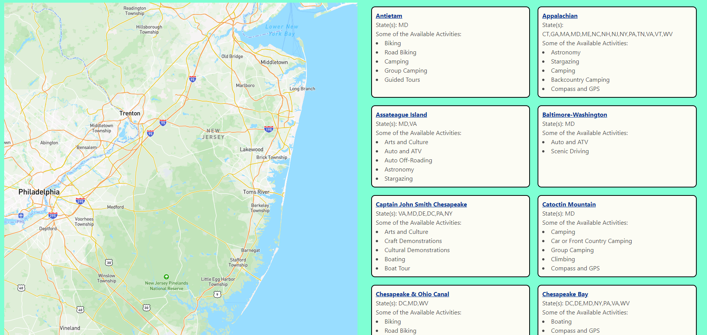
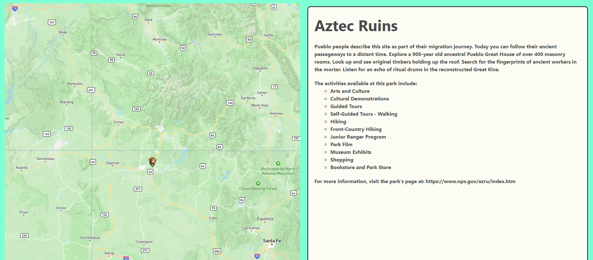

# p1-national-parks-locator

## Description

Welcome to [National ParkFinder](https://collylee.github.io/p1-national-parks-locator/), a page that is here to help you plan your next outdoor getaway. All of the travel options in the United States can be overwhelming to a budding traveler, but we've developed a page that helps to organize everything you need to know in one place.

This application requires heavy lifting from two API calls, one from the National Parks Service to fetch park details, and another from MapBox to show the geographical location of the park. Luckily, the two APIs work well hand-in-hand, which allowed us to build an application that can all exist on one webpage. No need to get lost moving from link to link to view the selection of parks.

The project was a rigorous exercise in API calls, requiring us to not only learn two APIs, but also to figure out how to get them to "talk." Because the National Parks API provides latitude and longitude data, a map application felt like a strong choice for a partner API.

## Usage

When you visit National ParkFinder, your first step will be to choose which state you are vacationing to. Once you have chosen a state, a list of parks that match your state criteria will be displayed below, next to the map (or below, for mobile). The search results will give you a brief list of a few of the activities each park has to offer. 

Clicking on one of the search results will bring up a more detailed description of the park, and zooms the map to the park's registered location. Please keep in mind that many national parks span multiple states. The map location is simply the "official" geo point registered with the National Parks Service.

If you want to search for parks in another state, you can simply choose a new state from the pulldown menu, and you will then be presented with search results for that new state.

Future development will include running searches by activity, and searching for parks by name.  

## Credits

This web application was created by Sarita Kharabe, Adam Baacke, and Colin Leidy. A special thanks to Leif Hetland and Fred Kamm who assisted with our GitHub issues.
